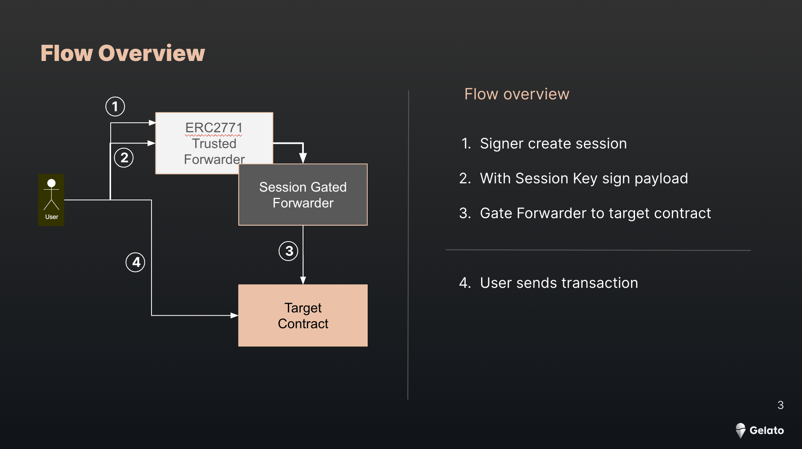
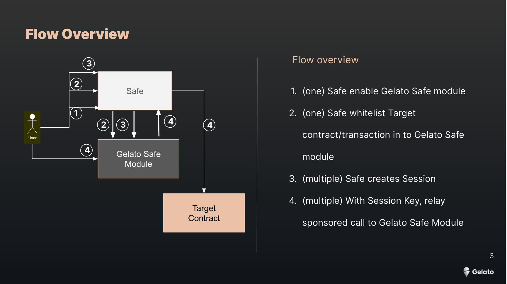

# Signless Ux with Session Keys

This repo includes two different implementations to allow signless Ux experience.

The first one is targeting a contract that implements ERC2771 and we have the possibility to update the trustedForwarded.

In the case that the target contract is not updateable, we propose an alternative method of interacting with the target contract through a safe.

## (EOA) Session Key Gated Forwarder

This project demonstrates the backend implementation of a contract called [Session Key Gate](contracts/SessionKeyGate.sol) to enable signless Ux.

The most important files to look at are:

- Session Key Gate contract [SessionKeyGate.sol](/contracts/SessionKeyGate.sol)
- Counter Contract [Counter.sol](/contracts/Counter.sol)
- TempKey class used to generate/store the Session Keys [TempKey](/scripts/tempKey.ts)

> **Note**  
> The Session Key Gate contract is deployed on Goerli at [0xde2568192B20A57dE387132b54C3fa492E33483](https://goerli.etherscan.io/address/0xde2568192B20A57dE387132b54C3fa492E334837#code) and the counter contract at [0x87CA985c8F3e9b70bCCc25bb67Ae3e2F6f31F51C](https://goerli.etherscan.io/address/0x87CA985c8F3e9b70bCCc25bb67Ae3e2F6f31F51C)

### Repos

- [React UI](https://github.com/gelatodigital/relay-session-key-ui.git)
- [Contracts](https://github.com/gelatodigital/relay-session-key-contracts.git)

## (SAFE) Gelato Safe Module Session Key 

This project demonstrates the implementation of a Gelato Safe module to enable Safe signless Ux.

The most important files to look at are:

- Gelato Safe Module [GelatoSafeModule.sol](/contracts/GelatoSafeModule.sol)
- Counter Contract [Counter.sol](/contracts/Counter.sol)
- TempKey class used to generate/store the Session Keys [TempKey](/scripts/tempKey.ts)

> **Note**  
> The Gelato Safe module is deployed on Goerli at [0xEBF7dc15b153601DdA7594DC7bC42105c1E06844](https://goerli.etherscan.io/address/0xEBF7dc15b153601DdA7594DC7bC42105c1E06844#code) and the counter contract at [0x87CA985c8F3e9b70bCCc25bb67Ae3e2F6f31F51C](https://goerli.etherscan.io/address/0x87CA985c8F3e9b70bCCc25bb67Ae3e2F6f31F51C)

### Repos

- [React UI](https://github.com/gelatodigital/relay-safe-session-key-ui.git)
- [Contracts](https://github.com/gelatodigital/relay-safe-session-key-contracts.git)
